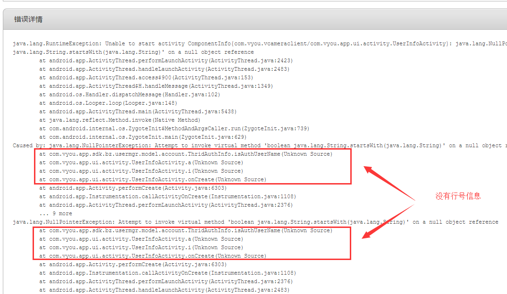
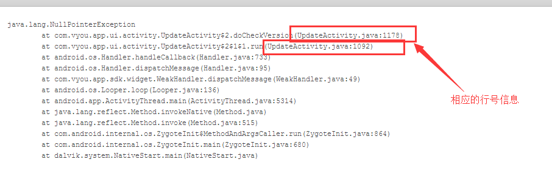

# 调整混淆配置，使得混淆后行号保留

## 起因

来公司没多久，就让修复友盟上出现的bug，然后就发现了一个问题。**异常信息中，竟然没有相应的行号信息！！！**有点无语，这些信息Debug的时候是有的，这里应该是release版本做了混淆导致的。问了同事，他说一直都是这样……好吧，难道就没发觉不对的地方吗？



上面就是没有的行号的错误报告。↑

这个影响还是挺坏的。因为你压根都不知道是方法哪一行报的错，你只能靠推断和猜，这导致某些bug下次还会出现，因为出错的地方根本不是你改的那里，而是另外一处。

## 分析原因

原因其实很明显，就是混淆机制将行号信息消除了

## 解决

没啥说的，在混淆文件中加入保留行号的配置：

```
-keepattributes SourceFile,LineNumberTable
```


有了相应的行号信息。↑

## 影响
友盟上的错误信息能看到行号了，从此就可以精确定位错误发生的地方（行号）。