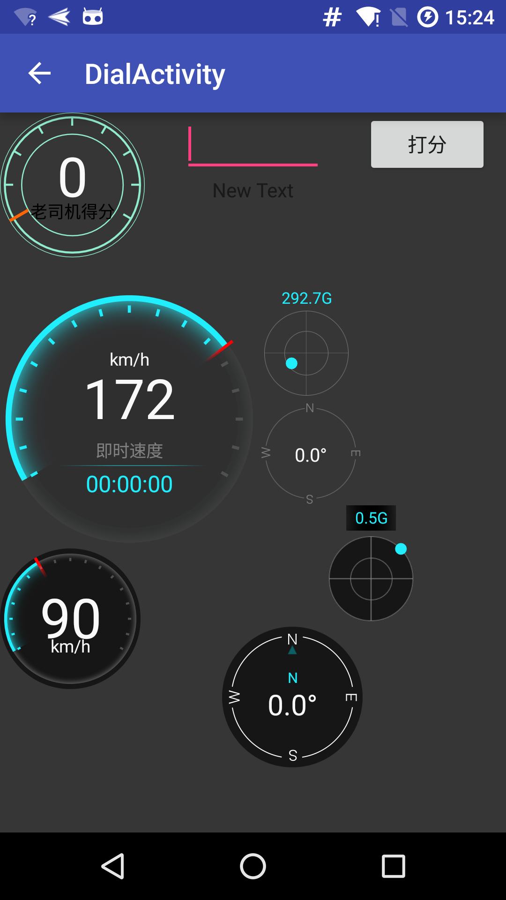

# 各种表盘

## 效果图


## 难点在于自然的渐变色
原生的渐变色比较生硬，然后上网找到一种优化方式，就是讲变化有线性渐变（y=x），变为曲线渐变（y=x²）。也可以参考源码

``` java
private void updateProgressPaint()
{
		int[] stopColors = GradientUtil.makeCubicGradientStopColors(Color.argb(127, 32, 238, 252), 15);
		float[] stopColorsPositions = GradientUtil.makeStopColorsPositions(0.7f, 15);
		RadialGradient mRadialGradient = new RadialGradient(cx, cy, innerProgressCircleRadius, stopColors,
				stopColorsPositions, Shader.TileMode.CLAMP);
		innerProgressPaint.setShader(mRadialGradient);
}
```

``` java
public class GradientUtil
{
	private static final LruCache<Integer, int[]> cubicGradientColors = new LruCache<>(10);
	private static final LruCache<Integer, float[]> cubicGradientPositions = new LruCache<>(10);

	private GradientUtil()
	{
	}

	public static float[] makeStopColorsPositions(float baseColorPosition, int numStops)
	{
		int cacheKeyHash = (int)(baseColorPosition*100);
		cacheKeyHash = 31 * cacheKeyHash + numStops;

		float[] posAndColors1 = cubicGradientPositions.get(cacheKeyHash);
		if (posAndColors1 != null)
		{
			return posAndColors1;
		}
		numStops = Math.max(numStops, 3);

		final float[] positions = new float[numStops];

		for (int i = 0; i < numStops; i++)
		{

			if (i == 0)
			{
				positions[i] = 0;
			}else if (i == 1)
			{
				positions[i] = baseColorPosition;
			}else if (i == numStops - 1)
			{
				positions[i] = 1;
			}else
			{
				positions[i] = (1 - baseColorPosition)*(i-1) /(numStops-2) + baseColorPosition;
			}
		}

		cubicGradientPositions.put(cacheKeyHash, positions);

		return positions;
	}

	public static int[] makeCubicGradientStopColors(int baseColor, int numStops)
	{

		int cacheKeyHash = baseColor;
		cacheKeyHash = 31 * cacheKeyHash + numStops;

		int[] stopColorsCache = cubicGradientColors.get(cacheKeyHash);
		if (stopColorsCache != null)
		{
			return stopColorsCache;
		}
		numStops = Math.max(numStops, 3);

		final int[] stopColors = new int[numStops];

		int red = Color.red(baseColor);
		int green = Color.green(baseColor);
		int blue = Color.blue(baseColor);
		int alpha = Color.alpha(baseColor);

		for (int i = 0; i < numStops; i++)
		{

			float x = i * 1f / (numStops - 1);
			float opacity = MathUtil.constrain(0, 1, (float) Math.pow(x, 3));

			stopColors[i] = Color.argb((int) (alpha * opacity), red, green, blue);
		}


		cubicGradientColors.put(cacheKeyHash, stopColors);

        return stopColors;
	}
}
```