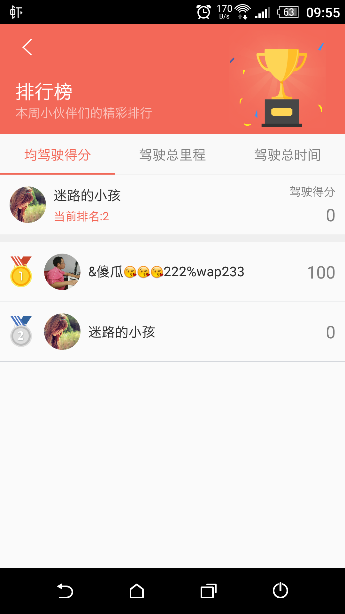

# 排行榜页面

## 效果图


## 头部效果实现

参考Github项目

[SubtitleCoordinatorLayoutExample](https://github.com/harcoPro/SubtitleCoordinatorLayoutExample)

## RecycleViewAdapter封装

自己封装的UniversalRecyclerViewAdapter
[GitHub项目地址](https://github.com/lylwo317/UniversalRecyclerViewAdapter)

思想是：将getView中的变化部分，抽象化和子类化。让具体变化的部分在子类中实现。


数据源转换
``` java
private List<IRecycleViewDisplayItem> convertAdapterDataType(List<ScoreRank> scoreRankList)
    {

         return ConvertFountional
                .forEach(scoreRankList, new ConvertFountional.Processor<ScoreRank, IRecycleViewDisplayItem>()
                {
                    @Override
                    public IRecycleViewDisplayItem process(ScoreRank f, int srcIndex)
                    {
                        IRecycleViewDisplayItem listItem;
                        if (srcIndex == 0)
                        {
                            listItem = new ScoreRankMineDisplayItem();
                            listItem.setDisplayData(f);
                        }
                        else
                        {
                            listItem = new ScoreRankNormalDisplayItem();
                            listItem.setDisplayData(f);
                        }
                        return listItem;
                    }
                });

    }

```

显示和业务逻辑
``` java
public class ScoreRankMineDisplayItem implements IRecycleViewDisplayItem<RankMineViewHolderController,ScoreRank>
{

    private ScoreRank scoreRank;

    @Override
    public void onShow(final Context context, RankMineViewHolderController viewHolderController, int position, GeneralRecyclerViewAdapter generalRecyclerViewAdapter)
    {
        viewHolderController.tvName.setString(scoreRank.user.nickName);
        viewHolderController.tvValue.setText(String.valueOf(scoreRank.score));
        viewHolderController.civMine.setImageUrl(scoreRank.user.coverPath);
        viewHolderController.civMine.setImageResource(R.drawable.user_img_unknown_user);
        viewHolderController.tvMyRank.setText(context.getString(R.string.track_rank_current_rank, scoreRank.rank));
        viewHolderController.tvUnit.setText(context.getString(R.string.track_rank_drive_score));
        viewHolderController.getRootView().setOnClickListener(new View.OnClickListener()
        {
            @Override
            public void onClick(View v)
            {
                TrackRankUtil.jumpToUserPage(context, scoreRank.user);
            }
        });
    }

    @Override
    public String getDisplayItemId()
    {
        return null;
    }

    @Override
    public void setDisplayData(ScoreRank o)
    {
        scoreRank = o;
    }

    @Override
    public ScoreRank getDisplayData()
    {
        return scoreRank;
    }
}
```

viewholder
``` java
public class RankMineViewHolderController extends AbsRecycleViewHolderController
{
    public CircleNetworkImageView civMine;
    public EmojiconEditText tvName;
    public TextView tvMyRank;
    public TextView tvUnit;
    public TextView tvValue;


    @Override
    protected void initView(View view)
    {
        civMine = (CircleNetworkImageView) view.findViewById(R.id.civ_user);
        tvName = (EmojiconEditText)view.findViewById(R.id.tv_name);
        tvMyRank = (TextView) view.findViewById(R.id.tv_my_rank);
        tvUnit = (TextView) view.findViewById(R.id.tv_unit);
        tvValue = (TextView) view.findViewById(R.id.tv_value);
    }

    @Override
    protected int getLayoutId()
    {
        return R.layout.rank_mine_list_item;
    }
}

```