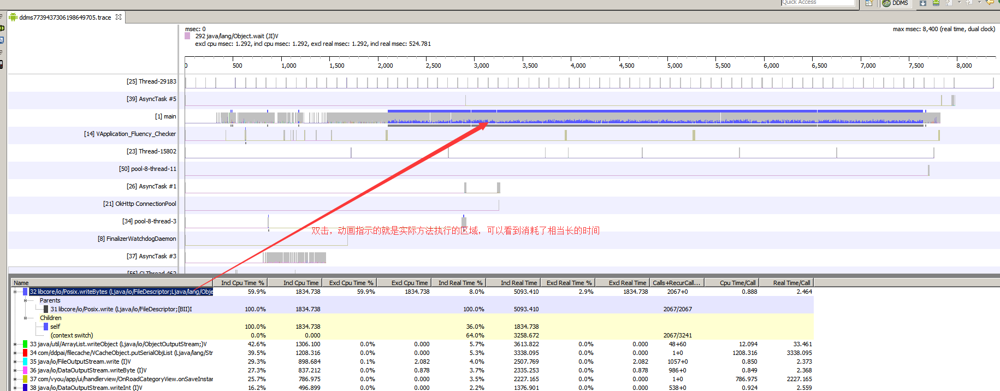

# 优化App卡顿和低端手机上高崩溃概率

## 现象
一个简单的查询数据库，并做展示的页面，偶尔出现了两秒的卡顿。继续研究会发现，在低端的手机上现象会更加频繁和明显。

## 原因
主线程执行耗时IO操作，这里主要是对象的序列化操作

## 分析过程
使用**TraceView**工具进行检测

## 解决方案
将序列化操作放到子线程中执行

## 影响
这个类的错误在代码中有很多处。比如打开摄像机相册页面，使用同事的魅族手机测试，会卡顿5秒，有时候还会闪退崩溃

一个使用魅蓝的手机同事，因为APP卡顿和频繁崩溃。换了一加手机。